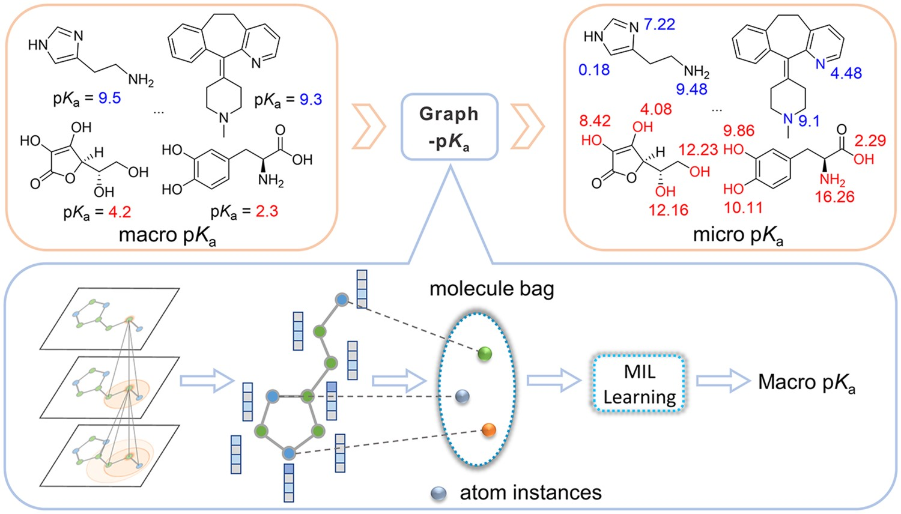

# Multi-instance learning of graph neural networks for aqueous pKa prediction

[](https://github.com/guanjq/targetdiff/blob/main/LICIENCE)

This repository is the official implementation of Multi-instance learning of graph neural networks for aqueous pKa prediction. [[PDF]](https://academic.oup.com/bioinformatics/article/38/3/792/6395352) 

<p align="center">
   
</p>

## Installation
### Install via conda (recommended)
```bash
# clone the environment
conda create -f environment.yaml
# activate the environment
conda activate pKa
```

## Dataset
not yet published

## Usage
See the jupyter notebooks.

## Citation
Please cite our paper if you find it helpful. Thank you!

Xiong, J.; Li, Z.; Wang, G.; Fu, Z.; Zhong, F.; Xu, T.; Liu, X.; Huang, Z.; Liu, X.; Chen, K.; Jiang, H.; Zheng, M. Multi-Instance Learning of Graph Neural Networks for Aqueous pKa Prediction. *Bioinformatics*, 2022, **38** (3), 792–798. https://doi.org/10.1093/bioinformatics/btab714
        
```
@article{xiong2021multi,
    title={Multi-instance learning of graph neural networks for aqueous pKa prediction},
    author={Xiong, Jiacheng and Zhaojun Li and Guangchao Wang and Zunyun Fu and Feisheng Zhong and Tingyang Xu and Xiaomeng Liu and Ziming Huang and Xiaohong Liu and Kaixian Chen and Hualiang Jiang and Mingyue Zheng},
    journal={Bioinformatics},
    volume={38},
    number={3},
    pages={792--798},
    year={2021},
    publisher={Oxford University Press}   
}
```
